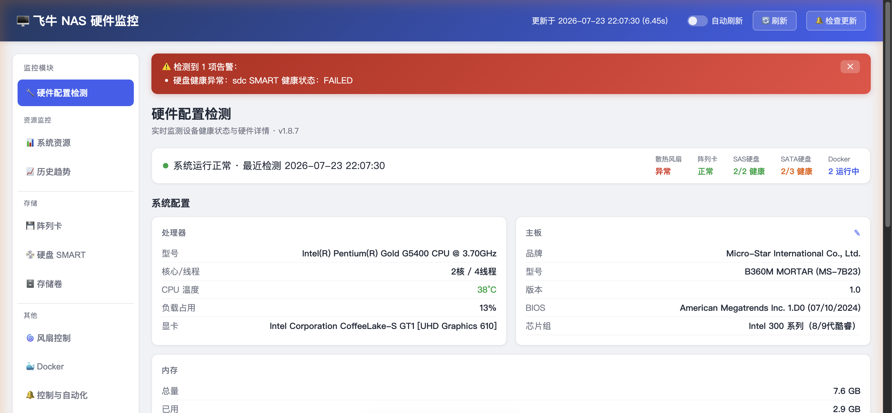
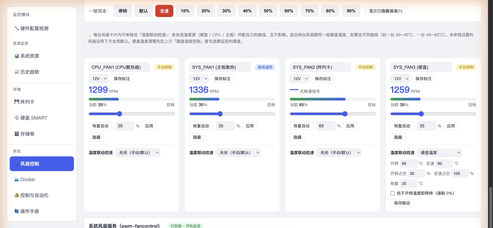
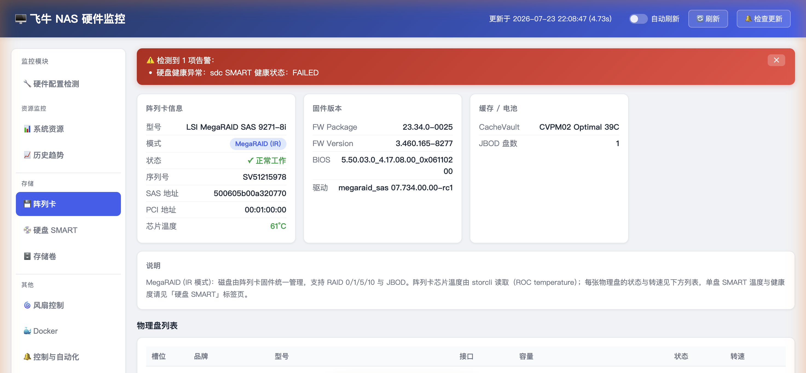

# nasdash

**当前版本：v2.1.0** · [下载最新 fpk](https://github.com/han951meng/nasdash/releases/latest) · [📖 操作手册](docs/使用手册.md) · [💬 飞牛社区讨论帖](https://club.fnnas.com/forum.php?mod=viewthread&tid=67060)

飞牛OS（fnOS）NAS 硬件监控面板 —— FPK 应用包

一个轻量级单文件 Flask Web 应用，通过 `storcli` / `smartctl` / `sensors` / `mdadm` / `lspci` / `ip` 等系统命令采集 NAS 硬件状态，以网页面板展示，免去每次 SSH 敲命令的麻烦。

## 预览

<table>
<tr>
<td width="33%"> <em>硬件配置检测</em></td>
<td width="33%"> <em>风扇控制（含逐风扇温度联动控速）</em></td>
<td width="33%"> <em>阵列卡（LSI MegaRAID）</em></td>
</tr>
</table>

## 安装

### 环境要求
- 飞牛OS（fnOS），应用监听 **127.0.0.1:9800**（仅本机内部监听，经飞牛 cgi 反代入口访问，不对外暴露）
- 管理员权限（风扇 PWM、storcli 等需 root，飞牛应用框架默认提供）
- 面板经飞牛 **cgi 反代** 打开（`/cgi/ThirdParty/.../index.cgi/`，由 index.cgi 在本机转发到 127.0.0.1:9800），**需先登录飞牛账号**才能访问；外部访问请走飞牛远程访问 / 反代，**不要直接暴露 9800 端口**

### 安装步骤
1. 下载 `nasdash.fpk`（GitHub Releases 或项目附件）
2. 打开飞牛OS **应用中心 → 右上角「+ 手动安装」**，上传 `nasdash.fpk`
3. 确认安装（按安装向导确认），**依赖自动安装**：smartmontools / lm-sensors / mdadm / Flask / dmidecode / i2c-tools
4. 安装完成后，桌面出现「NAS硬件监控」图标，点击即可打开（经飞牛 cgi 反代入口，需登录飞牛账号）

> **storcli 已随包内置**：LSI MegaRAID / HBA 直通卡用户无需从 Broadcom 官网手动下载，安装即自动落地到 `/opt/MegaRAID/storcli` 并建软链。
> 旧版手动装过依赖的机器：直接覆盖安装即可，`install_callback` 会跳过已装工具。

## 功能

左侧边栏共九个功能模块（硬件配置检测 / 系统资源 / 温度监控 / 历史趋势 / 硬盘 SMART / 存储卷 / 风扇控制 / Docker / 控制与自动化），外加「操作手册」和「关于 nasdash」两个常驻入口，覆盖 NAS 硬件运维核心场景：

### 🏠 硬件配置检测（首页仪表盘）
单页总览，进入即看全貌：
- 顶部状态栏：实时概览（散热风扇 / 阵列卡 / SAS 硬盘健康 / SATA 硬盘健康）
- 系统配置：处理器（含型号、核心/线程）、显卡（核显 / NVIDIA / AMD 独显自动识别）、内存（品牌取自 SPD 直读，区分模组厂与颗粒厂）、主板型号（DMI 直读品牌 / 型号 / 版本 / BIOS / 芯片组）、系统信息（含运行时间）、网络（硬件配置检测页显示 IP / IPv4/IPv6 / MAC / 协商速率 / 双工 / MTU / 厂商 / 驱动 / PCI 位置 / UP-DOWN 状态；系统资源页合并显示全部网口收发速率，每秒刷新）
- 显卡监控（核显 / NVIDIA / AMD 独显）：温度墙传感器代号中文化（如 CPUTIN→CPU 温度，悬停看原名）；卡片默认只显示名称 / 温度 / 显存容量，点「更多参数」展开 PCIe 位置与通道 / 驱动版本 / 核心·显存频率 / 显存位宽 / 实时功耗；AMD 独显可识别显存位宽与显存类型；显卡名智能精简（如「UHD Graphics 610」，完整设备名悬停可见）
- 阵列卡 & 磁盘：卡型号与物理盘、SMART 健康速览（v2.0.1 起阵列卡信息已合并进首页仪表盘，不再独立成页）

#### 阵列卡（自动检测卡类型，在硬件配置检测页内）
通过 `lspci` 自动识别存储控制器类型，分三种情况展示，避免误报：
- **MegaRAID 阵列卡**（如 LSI 9271-8i，IR/RAID 模式）：走 `storcli /c0 show` 显示完整信息——型号 / 序列号 / SAS 地址 / 固件版本 / BIOS 版本 / 驱动版本 / PCI 地址、CacheVault 缓存电池状态、**ROC 芯片温度**、JBOD 物理盘列表（槽位 / 品牌 / 型号(+特性徽章) / 接口 / 容量 / 状态 / 转速）。双磁臂（双执行器）盘显示整盘标称容量（如 14T）并标注每执行器容量
- **HBA 直通卡**（如 LSI 9300-8E，IT 模式）：显示卡型号与「IT 直通模式」说明，阵列卡信息**额外显示 HBA 芯片温度**（通过 `storcli /c0 show temperature` 读取 ROC temperature，如 65°C）；每块盘温度仍前往「硬盘 SMART」标签页查看（直通卡盘由系统直接识别为 `/dev/sdX`，由 smartctl 直读）
- **纯 SATA 主板**（无独立阵列卡）：提示无独立阵列卡，温度请见「硬盘 SMART」标签

### 📊 系统资源（任务管理器风格）
- **CPU 使用率**：大百分比 + 进度条，实时更新，附 60 秒滚动折线
- **内存 / Swap**：使用率进度条
- **实时功耗**：CPU+内存实时功耗（RAPL 硬件测量，Intel CPU 才有；超 40W 标红、超 20W 标橙）
- **网络实时速率**：实时收发速率 + 60 秒滚动折线（参考 Windows 任务管理器）；多网卡「网口1/2/3/4」标签页切换，按口查看各自速率
- 磁盘 I/O（读写速率）

> 温度 / 风扇 / 电压已挪到「温度监控」「风扇控制」专属页面（v2.0.4 起）；网卡 IP / MAC / 协商速率 / 双工 / MTU / 驱动等静态详情见「硬件配置检测」首页的网络卡片。

### 🌡️ 温度监控
- 顶部 hero 四个数：**CPU 温度 / 阵列卡温度 / 最高温度 / 平均温度**
- 温度墙网格：主板所有温度测点 + 阵列卡芯片温度（已过滤无效 0°C / 负温），统一高度对齐；绿=正常 / 橙=偏高 / 红=危险
- 「CPU 封装温度」带 **★最准** 角标（CPU 内部传感器直读）；鼠标悬停卡片可看原始测点名（如 CPUTIN/SYSTIN）
- 实时刷新：温度墙每 5 秒就地更新温度数字；系统资源页 CPU / 内存 / 网络 / GPU 轻量数字每秒更新（均读取后台缓存，不重复执行全量硬件检测）

> 各硬盘温度与「核心 / NVMe / SSD / 机械」分组展示在「风扇控制」页顶部的当前温度概览里。

### 📈 历史趋势
- 磁盘 I/O（读/写速率）折线图，支持 **24 小时 / 7 天 / 30 天** 范围切换，数据自动降采样并保留 30 天
- 数据来自 SQLite 本地库，无需额外服务，重启不丢

### 💿 硬盘 SMART
- 同时支持 SAS/SCSI 盘和 SATA/ATA 盘
- 自动识别硬盘品牌与特性（如希捷 / 西数 / 东芝 / 三星，双磁臂 / 双执行器盘带徽章）
- 健康状态（OK/PASSED 标绿，异常标红）
- 温度 / 通电时长 / 坏块计数 / 错误计数
- **机械盘显示真实转速**（来自 smartctl Rotation Rate，如 7200 rpm / 5400 rpm）；SSD 显示「固态(SSD)」
- SATA 盘额外显示 Reallocated / Pending / Uncorrectable / UDMA CRC
- 容量从 smartctl 读取（兼容阵列卡后 lsblk 返回 0 的情况）
- **硬盘自检（A/B/C 三档）**：可对盘体检或排查坏道——A 档 SMART 长自检（只读、不伤数据，可中止、实时看进度与 PASS/FAIL 结论）；B 档坏块慢扫（写满清空数据，仅放行独立盘，在用盘按钮自动置灰、硬点被拦，避免误清）；C 档只读表面扫描（v2.0.5 新增：像硬盘哨兵那样<b>只读</b>扫盘面，不写数据、不伤盘，<b>所有盘都能跑</b>——包括正在用的盘/阵列成员）

### 🗄️ 存储卷
- mdadm RAID 阵列状态（级别 / 成员盘 / 容量）
- 挂载点容量（总大小 / 已用 / 可用 / 使用率 / 文件系统类型）
- 自动过滤 docker overlay / tmpfs 等非存储卷

### 🌀 风扇控制（独立模块）
- **当前温度概览**：页顶显示全机温度——CPU / 主板 + 各硬盘温度，按 **核心 / NVMe / SSD / 机械** 分组，一眼看清哪组盘在发烫
- **调速方式识别与切换（v1.9.5）**：面板显示每个风扇口是 4 针 PWM 还是 3 针 DC 调速（signal=PWM/DC），可一键切换；能否切换由主板风扇口硬件决定，切不动会明确提示原因（如 NCT6797 仅 PUMP 口支持切换）
- 预设档位（默认 / 全速 / 10% … 90%）一键调速，卡片实时显示 RPM 与占空比
- 每个风扇可网页自定义名称（如「CPU 风扇」「机箱风扇」）与供电电压标注（12V / 5V / 未知），按安装实例持久化，硬件无关不写死机型
- 两套独立温控曲线，互不干扰、可分别接管不同风扇：
  - **硬盘温控**（disk_temp）：勾选监控硬盘，设开转/全速温度与占空比，按最热盘温度平滑调速；监控盘全部休眠时停转风扇；可指定只控部分风扇（如机箱风扇 / SYS_FAN2）
  - **主板/CPU 温控**（sys_temp）：按 CPU 封装温度或主板温度调速，与硬盘温控对称配置
  - 两套均带「恢复自动温度」滞回：温度降到该值以下时受控风扇交还主板/内核自动控速，升回开转温度才再次接管，避免临界抖动；全速档即真正满转
- **曲线编辑器**：自定义「温度→PWM」多点曲线，一键套用静音 / 均衡 / 性能预设，持久化到 @appdata；不设曲线时回退线性映射
- 手动调速下限放宽至 0%（停转）；恢复自动优先交还系统风扇服务，否则走 nasdash 自带保守温控曲线（按 CPU 温度、钳制 30~70%）
- **风扇控制接管总开关**：风扇控制页顶部一键接管 / 交还风扇调速。接管后由 nasdash 按温度自动调、并停掉飞牛 FCS；交还后交回飞牛原服务，界面做了防卡死保护，开关不会点不动

#### 与 FanControlServer 的共存（安全接管）

有用户在论坛反馈：nasdash 自己已经有风扇控制逻辑，还留着 fnOS 自带的 **FanControlServer（FCS）**，两个一起跑会不会冲突？

- **冲突根因**：FCS 与 nasdash 都直接写 sysfs 的 `pwmN` 节点来调速。若两者**同时**写同一个 PWM 通道，会互相抢控制权，出现转速乱跳。问题不在 FCS 本身，而在于「两套调速器同时写同一通道」。
- **nasdash 的处理 = 安全接管（而非简单禁用）**：当 nasdash 检测到自己正在主动控速（手动档 / 温控曲线 / 自动化规则接管了某风扇）时，会**自动先停止 FanControlServer**（`systemctl stop` 优先，`pkill` 兜底）；当这些风扇**全部交还「主板/内核自动控温」**后，nasdash 会**自动把 FanControlServer 重新拉起**。也就是说，nasdash 只在「自己正在控速」的窗口内临时接管，平时 FCS 仍照常工作，二者不再冲突。
- **默认零打扰**：用户未启用任何控速时，nasdash **完全不触碰** FCS；停/启服务全程 best-effort，失败静默，绝不因此中断风扇调速。
- **结论**：**不需要手动去杀 FCS**。既保留 FCS 作为可选回退，又消除了「两套调速器抢写 PWM」的隐患。需要永久禁用 / 恢复 FCS 时，可用 SSH 执行 `systemctl disable/enable pwm-fancontrol`（v2.0.5 起面板不再提供一键开关 UI）。
- 关于名字里的「it8772 风扇」字样：那是机器上 **FCS 旧配置残留的标签**，与冲突无关，可在风扇卡片「自定义名称」里改掉。

### 🐳 Docker
- 容器运行状态概览（运行中 / 总数）
- 容器列表：状态 / 名称·镜像 / 占用内存（字节+百分比）/ **CPU 占用率** / **网络 RX·TX 速率** / **端口映射（自动探测，支持 host 与 bridge 模式）/ 运行时长（中文）**
- 已停止容器标注「容器停止不检测端口」

### 🔔 控制与自动化
- **活动告警**：每 15 秒自动刷新，红色=严重问题、橙色=警告，正常时显示「当前无活动告警 ✓」
- **告警规则**：CPU 最高 85°C / 主板·芯片组最高 75°C / 硬盘最高 60°C / 内存占用上限 90% + 硬盘 SMART 健康（pre-fail / 异常）告警；超阈值自动触发；温度/硬盘健康独立开关
- **通知渠道**：面板内提示（始终记录到应用通知日志）+ 可选 **Telegram / Bark / 邮件(SMTP)** 推送，含「发送测试通知」
- **一键健康报告**：导出全部硬件状态与活动告警的 **JSON**（留档）或 **HTML**（排版报告，含分级运行日志）

## 依赖

| 工具 | 用途 | 必需 | 自动安装 |
|------|------|------|----------|
| Python 3 + Flask | Web 框架 | ✅ | ✅ pip/apt |
| smartctl (smartmontools) | 硬盘 SMART | ✅ | ✅ apt |
| sensors (lm-sensors) | 温度/风扇/电压 | ✅ | ✅ apt |
| mdadm | RAID 阵列 | ✅ | ✅ apt |
| storcli | LSI MegaRAID 阵列卡信息 | ❌ | ✅ 随包内置 |
| lspci (pciutils) | 显卡 / 阵列卡识别 | ✅ | 系统自带 |
| ip (iproute2) | 网卡 | ✅ | 系统自带 |

**storcli 现已随包内置**：LSI MegaRAID 阵列卡（IR/RAID 模式）走 `storcli /c0 show` 读取完整信息（含 ROC 芯片温度），HBA 直通卡（IT 模式）额外走 `storcli /c0 show temperature` 读取芯片温度（HBA 卡的 `/c0 show` 不含温度字段，这是正常现象，并非面板 bug）。安装时由 install_callback 自动落地到 /opt/MegaRAID/storcli 并建软链，无需再从 Broadcom 官网手动下载。纯 SATA 主板（无 LSI 卡）用户可忽略此工具。

## 数据来源

| 数据 | 命令 |
|------|------|
| 阵列卡 | `lspci` 检测卡类型；MegaRAID 卡 `storcli /c0 show`，HBA 卡额外 `storcli /c0 show temperature` 取芯片温度 |
| 硬盘 SMART / 转速 | `smartctl -a/-i /dev/sdX` |
| 温度/风扇/电压 | `sensors -j`（JSON 输出分类解析） |
| 风扇转速 | `sensors -j` + sysfs `pwmN_enable` / `pwmN` |
| 显卡 / 阵列卡 | `lspci` |
| 网卡 | `ip -o link/addr` + `/sys/class/net/` |
| RAID 阵列 | `cat /proc/mdstat` |
| 挂载点 | `df -h` |
| CPU | `lscpu` |
| 内存 | `cat /proc/meminfo` |

## API

- `GET /` — 面板页面
- `GET /api/all` — 全部数据 JSON（硬件配置检测 + 阵列卡 + 硬盘 + 系统 + 存储 + Docker）

## 技术栈

- Python 3 + Flask（单文件应用）
- storcli / smartctl / sensors / lspci / ip / mdadm 系统命令采集
- 内联 HTML/CSS/JS 前端，无构建步骤
- 标准 fnOS FPK 应用包格式

## 注意事项

- 服务端口 9800（在 manifest 的 service_port 固定声明），修改需同步更新 manifest 的 service_port；调试重启必须通过 fnOS 服务管理，不要手动 `setsid app.py`，避免端口残留
- smartctl / storcli 需要 sudo 权限（飞牛OS 应用框架默认提供）
- 风扇 PWM 模式显示依赖 it87 / nct6775 等主板传感器驱动
- 双磁臂（双执行器）硬盘：LSI 阵列卡会将其每个执行器作为独立盘暴露给系统（如各 7T），面板在硬件配置检测首页显示整盘标称容量（如 14T）并标注每执行器容量

## 排障：风扇页显示「未检测到可调控风扇」

风扇控制页顶部显示「可控风扇 0」并提示「未检测到可调控风扇」，**通常不是 nasdash 的问题**，而是系统还没加载风扇传感器驱动——nasdash 只能接管系统已经暴露出来的调速接口，接口都没有，它自然接管不了。

解决步骤：
1. 打开飞牛**应用中心 → 搜索 `ite-it87`**（社区维护的传感器驱动，支持 ITE IT87/IT86 系列芯片，适配 fnOS 内核 6.12/6.18 等）→ 安装。
2. 若风扇控速芯片是 Nuvoton NCT 系列（如多数消费级主板 B360/B365），系统一般已自带 `nct6775` 驱动；若没有，可手动 `modprobe nct6775`。
3. 装完驱动**重启一下 nasdash**（应用中心里停掉再开，或重启 NAS），风扇页刷新即自动列出 PWM 通道，可直接接管调速。

| 情况 | 说明 |
|------|------|
| 装了 ite-it87 后能列出风扇 | 风扇控速芯片是 ITE/IT86 系列，驱动一装系统就暴露了 PWM 接口，nasdash 自动接管，**无需重装 nasdash** |
| 装了还是 0 | 硬件风扇控速芯片不在 ite-it87 支持范围（如部分 N150 平台走 PCH/EC 直控，飞牛只暴露转速、不暴露调速接口），第三方暂时接管不了，只能等飞牛官方适配 |
| 飞牛资源管理能显示转速、nasdash 却显示 0 | 正常——飞牛自家读转速走内部接口；nasdash 要的是标准调速接口，两者不是一回事 |

> nasdash 是「枚举系统里所有 hwmon 风扇接口、不挑芯片」的，所以装好对应驱动后**不用重装 nasdash，刷新即生效**。

## 实测硬件配置（避坑说明）

本应用目前主要在以下硬件上完成实测验证。飞牛OS / 不同主板 / 阵列卡组合下，风扇接口命名与内核 `hwmonN` 编号可能不同，**以下现象属正常，并非面板 bug**：

### 测试机配置

| 组件 | 配置 |
|------|------|
| 系统 | 飞牛OS（fnOS，基于 Debian 12），应用端口 9800 |
| 主板 | MSI B360M MORTAR（Intel B360 芯片组） |
| CPU | Intel 奔腾 G5400（风冷，散热器接 CPU_FAN1） |
| 阵列卡 | LSI MegaRAID 9271-8i（2× ST14000NM SAS 14T，JBOD 模式），storcli 随包内置 |
| 传感器芯片 | Nuvoton NCT6797D（nct6775 驱动），本机**唯一真实风扇控制器**，暴露 5 个 PWM 通道（pwm1–pwm5）；无 it87 芯片，「it8772 风扇」字样来自旧 FanControlServer 配置残留 |

### 风扇接口接线（已逐一拉满转速肉眼核对）

| 主板接口 | 接的设备 | 测速 | 说明 |
|----------|----------|------|------|
| CPU_FAN1 | CPU 散热器风扇 | ✅ 有 | — |
| SYS_FAN1 | 主板/芯片组散热风扇 | ✅ 有 | — |
| SYS_FAN2 | 阵列卡风扇 | ❌ 无 | 缺测速线，面板显示「无转速信号」，但能正常调速 |
| SYS_FAN3 | 硬盘散热风扇 | ✅ 有 | 一分二转接两把 PWM 风扇 |
| PUMP_FAN1 | 空口 | — | 风冷机未接水冷泵，无风扇，面板可一键隐藏 |

### 常见「看起来像 bug」的正常现象

| 现象 | 说明 |
|------|------|
| 风扇显示「无转速信号」 | 该通道接的风扇没接测速线（3 针/缺 tach），或是空接口（如 PUMP_FAN1）。面板仍能调速，只是读不到 RPM 数字，可点「隐藏」收起。 |
| hwmon 编号跨重启变化 | 内核给风扇控制器分配的 `hwmonN` 路径（如 nct6797 在 hwmon3↔hwmon4 间漂移）不固定。面板已自动校正——调速请求按通道序号(idx)命中真实通道，不受 hwmon 编号变化影响；自定义名称/隐藏也按 idx 兜底，重启后不乱。 |
| 名字显示成「it8772 风扇 N」 | 读取到机器上旧 FanControlServer 配置残留标签。可在风扇卡片「自定义名称」改成你喜欢的（如 CPU 风扇），按安装实例持久化，硬件无关不写死机型。 |
| 手动调速后停在目标值、不再回弹 | 设计行为——拖动滑块即切换为手动控制并平滑过渡到目标占空比，转速数字继续爬升；点「恢复自动」才交还主板/内核自动控温（nasdash 自带保守曲线钳制 30~70%）。 |
| 滑块最低 10% | 手动调速下限为 10%（该硬件 10% 仍可运转），非 0%。 |

> 本应用仅在以上硬件完成完整实测；其他主板/阵列卡组合功能可能不同，欢迎在 Issues 反馈。

## 更新日志

### v2.1.0
- 系统资源页新增 GPU 占用与多显卡切换，修复核显占用率、实时刷新、温度墙文字布局问题

### v2.0.9
| 改动点 | 说明 / 效果 |
|---|---|
| 风扇页刷新卡死修复 | 飞牛升级到 1.2.x 后风扇页刷新圈一直转，根因是新版飞牛网关对第三方应用接口变慢、面板原本每秒刷新 2 次堵死慢通道；已降频到每 5 秒一次并加请求超时与防重入，刷新圈正常停下（已实测） |
| 接管风扇控制后转速即时响应 | 点「接管风扇控制」后风扇转速要等 45~60 秒才变化，根因是控速循环每轮同步跑 systemctl 查询拖慢、转速按小步平滑爬升；已去掉每轮 systemctl 查询、转速改为即时到位（接管后直接跳到温度档位、关闭瞬间降到待机，已实测） |
| 历史趋势页（新增） | 六维度历史趋势（磁盘 I/O、网络、功耗、温度、风扇、内存），支持 24 小时 / 7 天 / 30 天切换 |
| 一键分析报告导出（新增） | 历史趋势页一键导出 HTML / Markdown / CSV 三格式分析报告（纯前端生成，数据不出 NAS） |
| 深色模式输入框底色自适应 | 风扇控制页「硬盘休眠联动」的分钟数字输入框在深色模式下白底白字看不见，已改跟随主题自适应底色 |
| 阵列卡 CacheVault 状态识别修复 | 阵列卡 CacheVault（掉电保护缓存）状态原来只匹配 CVPMxx 窄格式，无卡（JBOD 直通）时误报「未检测到」并误触发状态异常告警；已新增多格式解析（CVPM / CacheVault_Info / CacheVault= / BBU）并只按归一化状态判断，无卡不再误报（已实测） |

### v2.0.8
- 阵列卡增强全部 7 项落地：物理盘定位/闪灯、一致性检查与进度、告警分级与按级别选通知渠道、定时巡检调度、SMART 错误自动 CopyBack 换盘、热备盘分配（全局/专用）、缓存策略展示（写回/直写）。本机为 JBOD 直通（无硬件 RAID 逻辑盘），依赖硬件 RAID 的功能已完成代码与降级验证，真实流程待有 VD 环境补测。

### v2.0.7
- 系统资源页网络卡片重新设计：支持多网口切换并显示网卡型号与驱动、上下行速率显示更紧凑准确；休眠硬盘不再误报红色健康警告（真实故障仍标红）；硬盘自检新增历史记录并修复预计剩余时间精度；系统资源页图表精简为极简风格

### v2.0.6

| 改动点 | 说明 / 效果 |
|---|---|
| 修复深色模式下拉框文字空白 | 风扇控制页「温度源」等下拉框在深色模式下文字可能完全不显示（与深色背景同色），2.0 以来一直存在、仅部分浏览器内核出现；现已修复 |
| 表单控件文字不再依赖浏览器 | 深色模式下所有下拉框/输入框文字统一显式设为白色，无论什么浏览器/内核都能正常显示 |
| 下拉列表适配深色主题 | 点开下拉弹出的选项列表同步改为深色底 + 白色文字，不再刺眼的白底黑字 |
